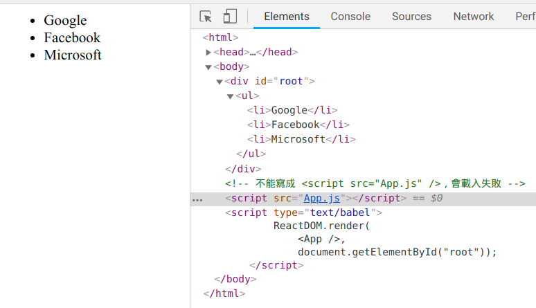

## 說明：
- 顯示更複雜的、階層式資訊：
```html
<ul>
  <li>Google</li>
  <li>Facebook</li>
  <li>Microsoft</li>
</ul>
```
<br>

- 使用 JSX 語法來表達（亦即 javascript 裡有 XML 標籤）
- 使用 React 單一元件檔案(.jsx)來產生傳統 JS 檔(.js)
```bash
$ npm install babel-preset-react
$ babel --presets react App.jsx -o App.js 
```
- ```--presets```: 在編譯前，執行指定的前置設定
- ```-o```: 產生輸出檔
- [What is the --save option for npm install?](https://stackoverflow.com/questions/19578796/what-is-the-save-option-for-npm-install)
- [npm-install](https://docs.npmjs.com/cli/install)

<br>

## 執行結果：


